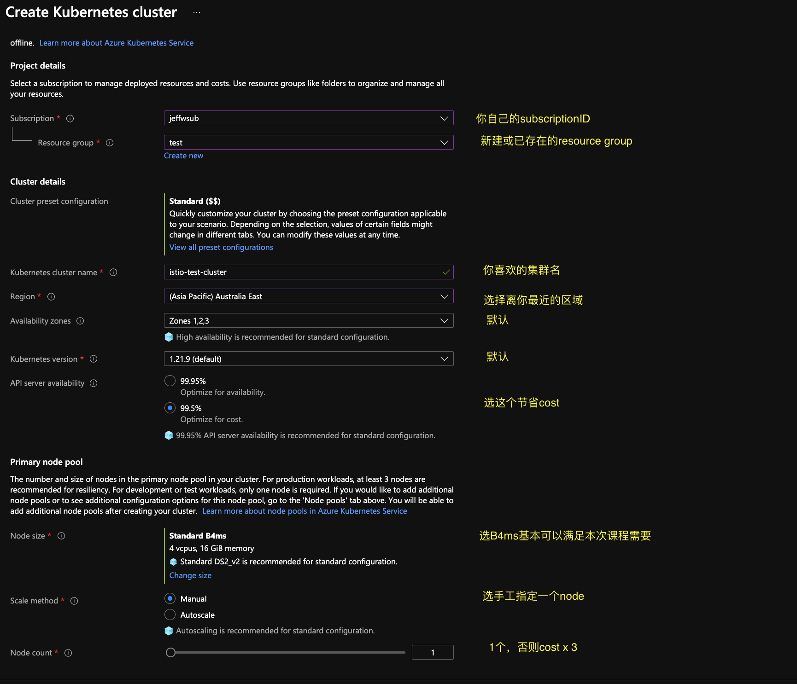
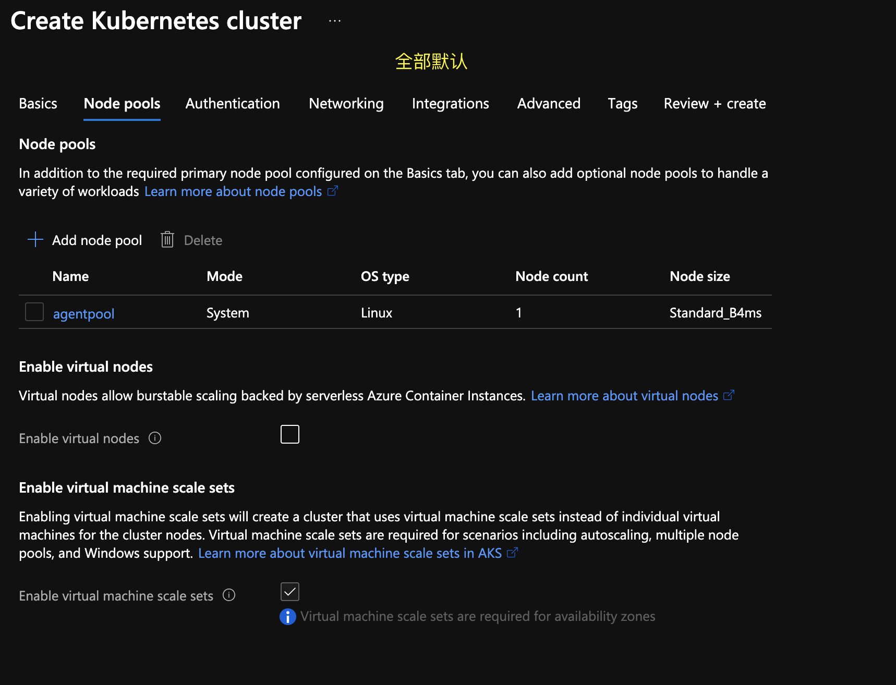
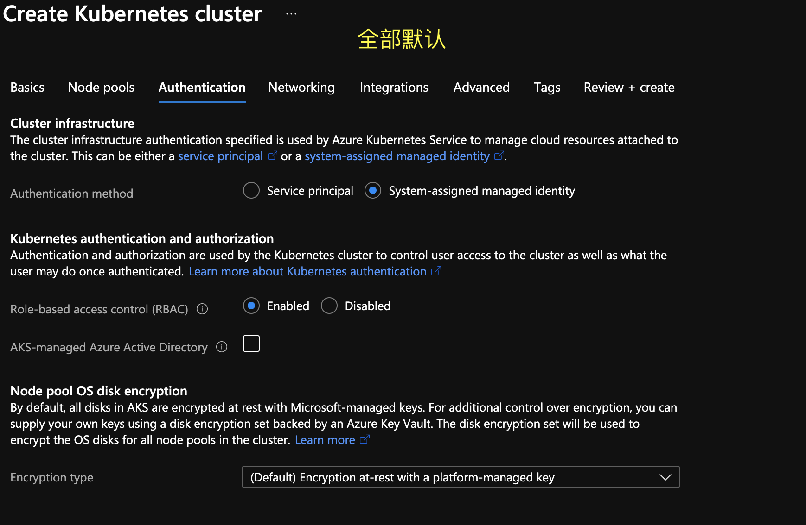
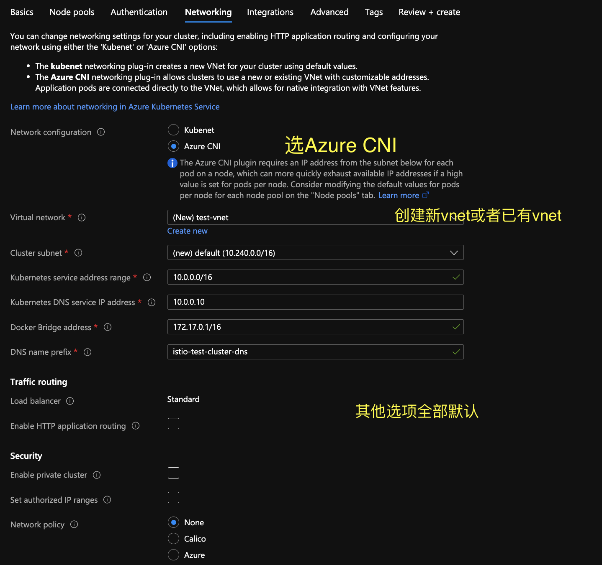
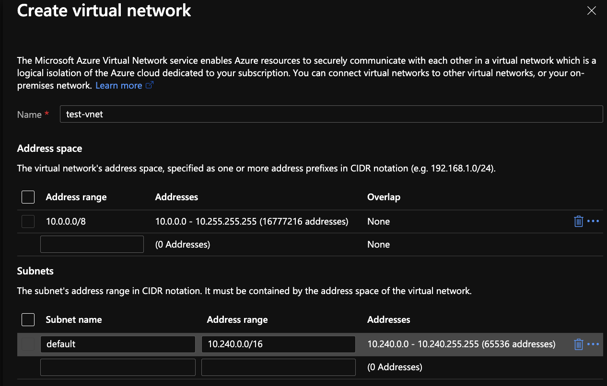
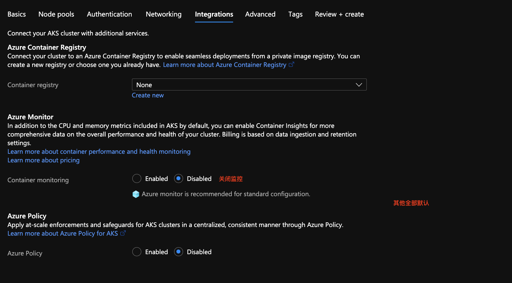
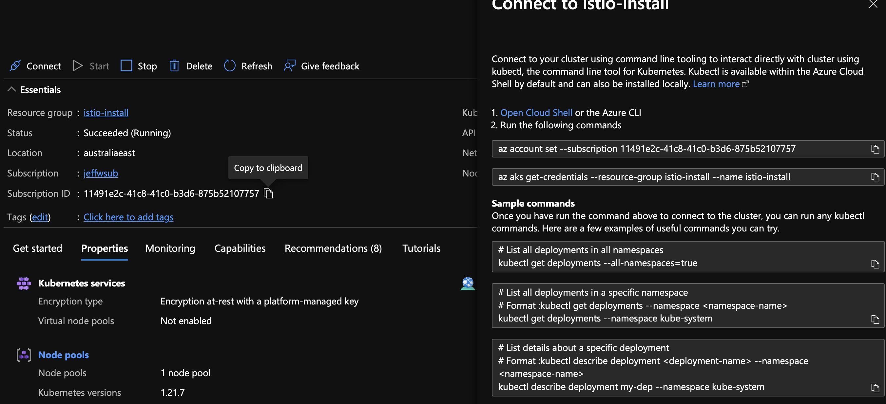

## 安装  azure cli

[windows azure-cli](https://docs.microsoft.com/en-us/cli/azure/install-azure-cli-windows?tabs=azure-cli)

[macOS azure-cli](https://docs.microsoft.com/en-us/cli/azure/install-azure-cli-macos)


## az login

```
az login -u <username> -p <password> --tenant <tenant>
```

## 创建 AKS 集群

1. 在azure 搜索框 输入 AKS，然后选择`Kubernetes Services`

2. 点击左上角的新建按钮  `+ Create` 由此创建新集群。

3. 填写集群基本信息
   

4. node pool - 全部默认
   

5. authentication - 全部默认
   

6. 网络设置
   
   

7. 集成服务
   

8. 其他全部选择默认，然后通过验证成功后点击创建集群
9. 集群创建成功后，可以通过connect 按钮获取链接集群的方式和证书
    