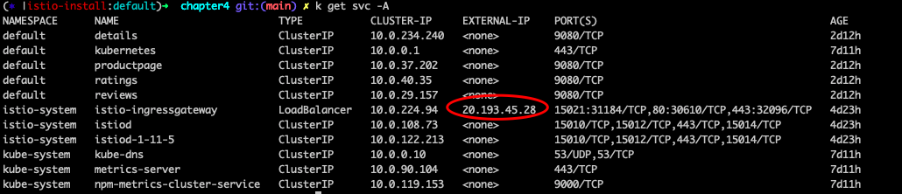

## 安装bookinfo 示例
```
kubectl label namespace default istio-injection=enabled
kubectl apply -f samples/bookinfo/platform/kube/bookinfo.yaml
kubectl get svc -A
kubectl get pods -A
```

## 安装ingress gateway
```
kubectl apply -f samples/bookinfo/networking/bookinfo-gateway.yaml
kubectl get svc -A
```

## 通过public IP查看bookinfo服务
