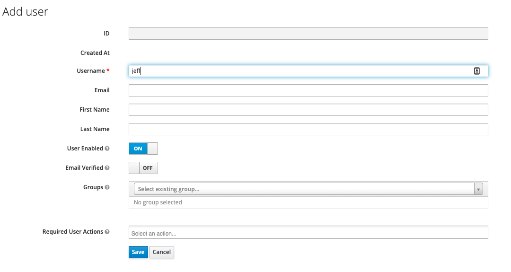

## helm安装keycloak
```
k delete deployment httpbin-v1 -n default
k delete deployment httpbin-v2 -n default
k delete deployment  fortio-deploy -n default
k delete deployment  sleep -n default


kubectl apply -f $istio_path/samples/httpbin/httpbin.yaml  -n default


helm repo add bitnami-aks https://marketplace.azurecr.io/helm/v1/repo
helm install my-keycloak bitnami-aks/keycloak --version 6.1.3  --set service.type=ClusterIP   --set postgresql.persistence.enabled=false
 ### remove pvc if the password didn't match
```

## 通过 Istio gateway和虚拟服务暴露服务接口
```
kubectl apply -f 2-keycloak-gw-vs.yaml

http://keycloak.istio.fun
```

## 得到登录信息
```
  echo Username: user
  echo Password: $(kubectl get secret --namespace default my-keycloak -o jsonpath="{.data.admin-password}" | base64 --decode)
```

## 登录后创建istio的域，角色，用户等

1. 创建新域：customer
   
2. 新建client： istio
   
3. 新建role: customer
   
4. 新建用户名/密码：密码必须反选 ·临时密码· 选择框
   
   
5. 新建role mapping：
   


##  生成httpbin的网关和虚拟服务
```
kubectl apply -f httpbin-gw-vs.yaml
```

## 测试服务
```
curl "http://httpbin.istio.fun/headers"
```


## 应用授权策略，只有通过认证的服务才能访问
```
kubectl apply -f 4-jwt-auth.yaml
```


```
curl \
  -sk \
  --data "username=jeff&password=jefftest&grant_type=password&client_id=istio" \
  http://keycloak.istio.fun/auth/realms/customer/protocol/openid-connect/token | jq ".access_token"

TOKEN=<above output>

curl -i http://httpbin.istio.fun/headers -H "Authorization: Bearer dfdggdfegg"
curl -i http://httpbin.istio.fun/headers -H "Authorization: Bearer $TOKEN"

curl -XGET -i http://httpbin.istio.fun/ip
```